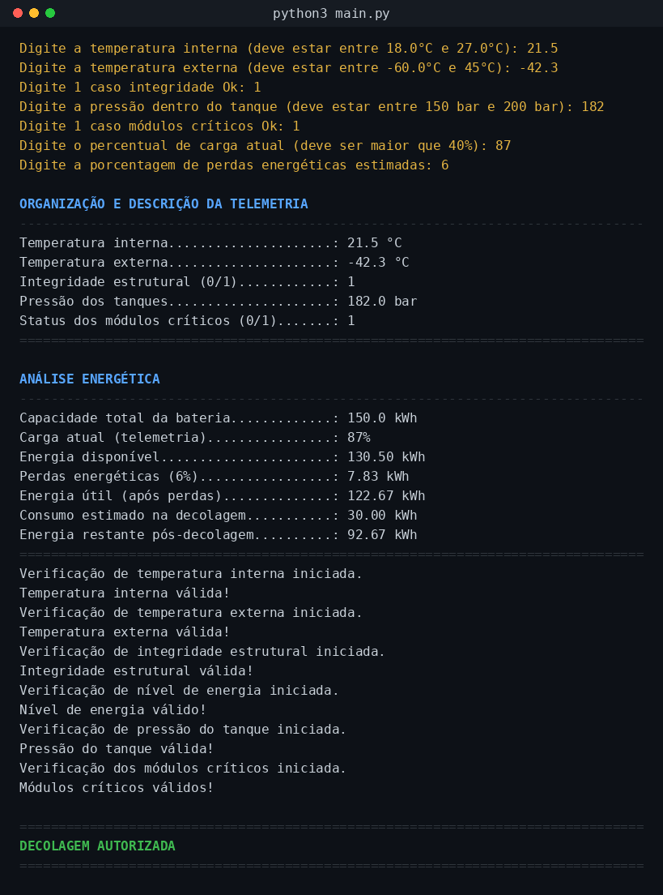
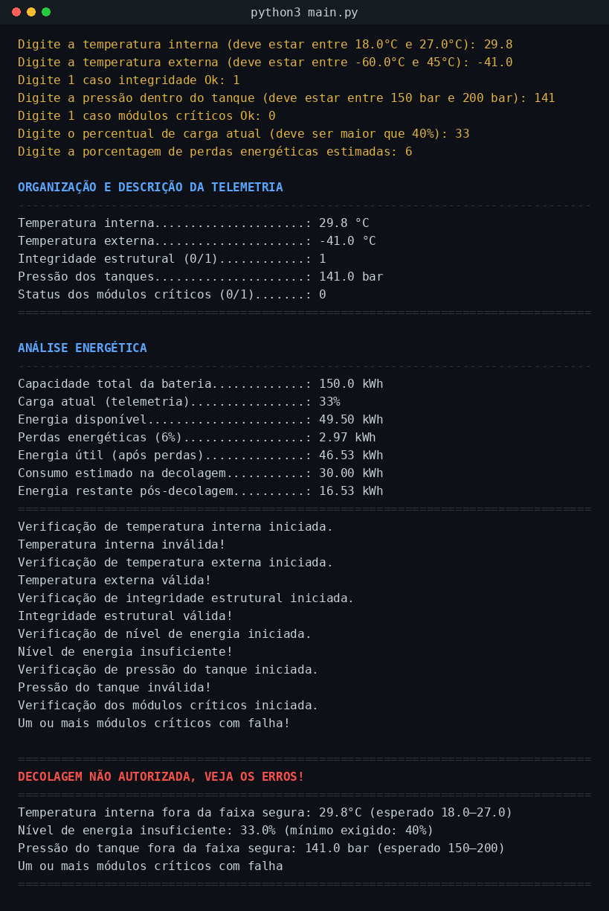
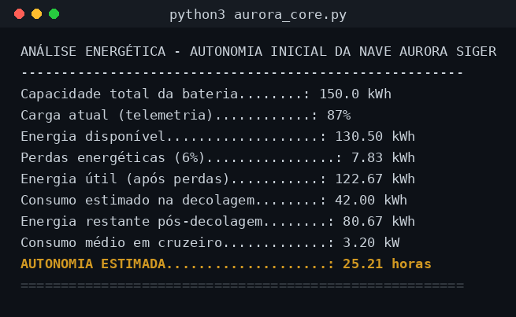

# 🚀 Missão Aurora Siger — Relatório Operacional de Pré-Decolagem

Atividade integradora que simula o sistema de verificação de pré-decolagem da nave **Aurora Siger**, unindo lógica computacional, automação em Python, análise energética, apoio de IA e reflexão ética/sustentável.

## 📌 Sobre o projeto

Este repositório contém a implementação completa do relatório operacional de pré-decolagem, dividido em seis etapas:

| Etapa | Descrição |
|---|---|
| 1.1 | Organização e descrição da telemetria da nave (temperaturas, integridade estrutural, energia, pressão dos tanques, módulos críticos) |
| 1.2 | Algoritmo de verificação (fluxograma + pseudocódigo) que decide **"PRONTO PARA DECOLAR"** ou **"DECOLAGEM ABORTADA"** |
| 1.3 | Implementação do algoritmo em Python, testada em dois cenários (nominal e com falhas) |
| 1.4 | Análise energética: cálculo da autonomia inicial da nave (capacidade, carga, consumo e perdas) |
| 1.5 | Análise assistida por IA: classificação dos dados, detecção de anomalias e sugestão de risco |
| 1.6 | Reflexão crítica sobre ética, impacto social da exploração espacial e sustentabilidade tecnológica |

Todo o desenvolvimento está consolidado no notebook [`Analise_Pre_Decolagem_Aurora_Siger.ipynb`](./Analise_Pre_Decolagem_Aurora_Siger.ipynb).

## 🗂️ Estrutura do repositório

```
.
├── Analise_Pre_Decolagem_Aurora_Siger.ipynb   # Notebook principal (todas as etapas)
├── README.md
└── imagens/
    ├── fluxograma_verificacao.png              # Fluxograma do algoritmo (item 1.2)
    ├── analise_energetica.png                  # Gráficos da análise energética (item 1.4)
    ├── print_execucao_nominal.png              # Print: verificação cenário nominal
    ├── print_execucao_falha.png                # Print: verificação cenário com falhas
    └── print_execucao_energia.png              # Print: saída da análise energética
```

## 🖥️ Prints da execução

**Verificação — cenário nominal (todos os parâmetros dentro da faixa segura):**



**Verificação — cenário com falhas (demonstra o ramo de abort do algoritmo):**



**Análise energética — autonomia inicial da nave:**



## ▶️ Instruções de execução

### Opção 1 — Google Colab (recomendado, não requer instalação)
1. Acesse [https://colab.research.google.com](https://colab.research.google.com);
2. `Arquivo → Fazer upload de notebook` e selecione `Analise_Pre_Decolagem_Aurora_Siger.ipynb` (ou abra diretamente a partir do GitHub, colando a URL do repositório);
3. Faça upload também da pasta `imagens/` para a mesma sessão do Colab (painel lateral esquerdo → ícone de pasta → *upload*) para que as imagens do fluxograma e do gráfico sejam exibidas;
4. Execute todas as células com `Ambiente de execução → Executar tudo`.

### Opção 2 — Localmente com Jupyter
```bash
# 1. Clone o repositório
git clone https://github.com/<seu-usuario>/aurora-siger-pre-decolagem.git
cd aurora-siger-pre-decolagem

# 2. Crie um ambiente virtual (opcional, recomendado)
python3 -m venv venv
source venv/bin/activate        # Windows: venv\Scripts\activate

# 3. Instale as dependências
pip install jupyter pandas matplotlib

# 4. Abra o notebook
jupyter notebook Analise_Pre_Decolagem_Aurora_Siger.ipynb
```

Em seguida, execute todas as células (`Cell → Run All` ou `Kernel → Restart & Run All`).

### Requisitos
- Python 3.9+
- `pandas`
- `matplotlib`
- (opcional) Jupyter Notebook/JupyterLab, ou uso via Google Colab

## 📄 Relatório em PDF

O relatório completo em PDF (consolidando telemetria, algoritmo, código, análise energética, análise assistida por IA e reflexão crítica) está disponível junto à entrega desta atividade.

## 👤 Autor

Atividade integradora — Missão Aurora Siger.
